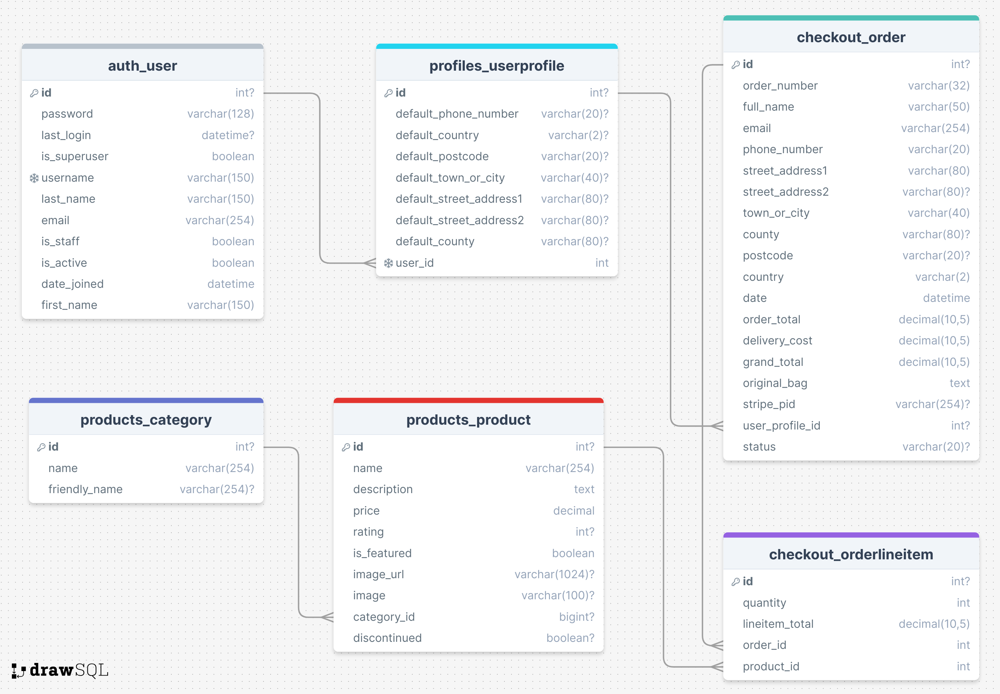

# Bubble Cwtch - E-Commerce Site - Using Django


#### **By Hannah Bowles**
[Click here to view the live web application](https://bubble-cwtch-7479c697eb91.herokuapp.com/)

Welcome to Bubble Cwtch, an e-commerce platform developed using Django, Python, JavaScript, CSS3 and HTML5. Created as part of Code Institute's Diploma in Web Application Development Course, Bubble Cwtch provides an online shopping experience featuring a handpicked range of artisanal bath bombs, soaps, and shower jellies.

- - -
## Table of Contents

- [Planning, Design & User Experience](#planning-design--user-experience)
    - [Strategy](#strategy)
    - [Scope](#scope)
    - [Structure](#structure)
    - [Skeleton](#skeleton)
    - [Surface](#surface)
- [Features](#features)
    - [Future Features](#future-features)
- [Technologies Used](#technologies-used)
    - [Languages](#languages)
    - [Frontend Frameworks / Libraries](#frontend-frameworks--libraries)
    - [Backend Modules / Packages & Frameworks](#backend-modules--packages--frameworks)
    - [Other Tools](#other-tools)
    - [External Sites / Resources / Software](#external-sites--resources--software)
- [Testing & Bugs](#testing--bugs)
- [Deployment](#deployment)
    - [Forking the GitHub Repository](#forking-the-github-repository)
    - [Making a Local Clone](#making-a-local-clone)
    - [Deploying Your App](#deploying-your-app)
- [Credits](#credits)
    - [Code](#code)
    - [Content](#content)
    - [Acknowledgments](#acknowledgments)


- - -

## Planning, Design & User Experience

I approached the planning and design of this project with a priority on providing a smooth user experience in line with e-commerce platform expectations. While ensuring I follow the principles of UX design and the five stages of strategy, scope, structure, skeleton and surface. My aim with Bubble Cwtch is to maintain the website's user-friendliness, visual appeal, and functionality in line with its original objectives while working to a deadline.

### Strategy

#### Project Aims

The primary aim of Bubble Cwtch is to provide customers with an intuitive platform to explore and purchase artisanal bath products. The website aims to showcase the unique range of bath bombs, soaps and shower jellies while providing efficient product and order management capabilities for the admin users.

#### Research

I conducted thorough research into similar websites within the cosmetics industry, as well as wider e-commerce sites. This research acted as a base for shaping the layout, design and functionality of Bubble Cwtch.

One significant influence was the product card design on Lush's website. After being inspired by Lush's product cards, I designed a similar product card for Bubble Cwtch that is attractive and user-friendly. Additionally, many websites included an 'add to bag' button in their product cards. Recognising the user benefits of this feature, I implemented it in Bubble Cwtch to simplify the shopping experience for users as it reduces the number of clicks required to purchase a product.

Websites visited for research:
- [Lush](https://www.lush.com/uk/en)
- [Bomb Cosmetics](https://bombcosmetics.co.uk/)
- [Pretty Suds](https://prettysuds.co.uk/)
- [Myddfai](https://myddfai.com/)
- [Adra](https://adrahome.com/)

####  User Stories

Below are the user stories I created after doing my research. These helped to guide the development and design.

1. As a general user:
  - 1.1: I want to understand the purpose of Bubble Cwtch immediately upon entering the website.
  - 1.2: I want to easily find products with intuitive navigation.
  - 1.3: I want Bubble Cwtch to be fully responsive for seamless browsing.
  - 1.4: I want to find Bubble Cwtch on social media for brand insights.
  - 1.5: I want effortless navigation back to the main site without relying on browser buttons if I encounter a non-existent page.
  - 1.6: I want to get feedback when interacting with Bubble Cwtch to confirm the success of my actions.

2. As a shopper:
  - 2.1: I want to browse Bubble Cwtch's products easily, with options to filter and search for specific items.
  - 2.2: I want to access more information about each product. 
  - 2.3: I want to be able to add a product to my bag quickly and with minimum clicks.
  - 2.4: I want to be able to shop for multiple items across Bubble Cwtch's product range.
  - 2.5: I want to be able to add multiples of a single product to my shopping bag at once.
  - 2.6: I want to be able to edit my shopping bag contents easily, adding or removing items as needed.
  - 2.7: I want to know the delivery charge for my order before proceeding to Checkout.
  - 2.8: I want my payment and order to be fully secure and trustworthy.
  - 2.9: I want the option to create an account on Bubble Cwtch to save my order history and track order status.

3. As a user with an account:
  - 3.1: I want my account on Bubble Cwtch to be secure and straightforward to set up.
  - 3.2: I want to see my order history easily, reviewing past purchases and tracking current orders.
  - 3.3: I want the ability to update and save my personal information within my account settings.
  - 3.4: I want to view the status of my order, allowing me to track its progress.

4. As an admin of the site:
  - 4.1: I want to be able to add and edit products easily.
  - 4.2: I want to the ability to remove products from sale, managing product availability.
  - 4.3: I want to be able to edit featured products.
  - 4.4: I want to be able to view all orders and filter by status.
  - 4.5: I want to be able to update the status of a customer's order easily. 
  - 4.6: I want to be easily navigate to the Django admin.
  - 4.7: I want the admin controls to blend with the site design but stand out.

- - -

### Scope

Using the user stories, I created a list of features I would like to add to the site to meet my user stories.

| Feature                                                  | Difficulty | Importance |
|----------------------------------------------------------|------------|------------|
| **Navigation:**                                          |            |            |
| Responsive Design                                       | 1          | 5          |
| Navigation - all page links                             | 1          | 5          |
| Navigation - search facility                            | 3          | 4          |
| **Footer:**                                              |            |            |
| Footer - company info                                   | 1          | 3          |
| Footer - social links                                   | 1          | 3          |
| **Home Page:**                                           |            |            |
| Home Page - branding & explanatory text                 | 1          | 4          |
| Home Page - Featured Products                           | 2          | 2          |
| **Product Management:**                                 |            |            |
| Products - Product cards with summary info              | 2          | 5          |
| Products - Product cards with add to bag button         | 2          | 4          |
| Products - Sorting/searching/filtering                  | 5          | 4          |
| Products - Detail Page with more info                   | 2          | 5          |
| Products - Detail Page add to bag & quantity select     | 4          | 5          |
| Products - CRUD functionality for admins                | 3          | 5          |
| **Shopping Bag and Checkout:**                          |            |            |
| Bag - Users can store items in a bag for purchase       | 4          | 5          |
| Bag - Users can edit product quantity and remove        | 3          | 5          |
| Checkout - Page with bag summary and delivery info      | 4          | 5          |
| Checkout - Secure payment system                        | 5          | 5          |
| Checkout - Page to show order summary on successful checkout | 3        | 3          |
| **User Accounts:**                                      |            |            |
| User accounts - all standard login/out/register functionality | 4     | 5          |
| User accounts - secure & reliable                      | 4          | 5          |
| Profile - User profile page showing order history      | 3          | 4          |
| Profile - Page to show historical order information    | 2          | 3          |
| Profile - Users can save & update their info for future orders | 4     | 4          |
| **Admin Section:**                                      |            |            |
| Links in main navigation                               | 2          | 4          |
| Profile - Filter/view all orders                       | 3          | 4          |
| Profile - Click through to view and edit order status          | 4          | 4          |
| Admin sections have a different look                   | 3          | 3          |

---

### Structure

- - -

### Skeleton
Add Diagram

#### Database Schema

Below is a visual representation of the database for bubble cwtch made using [DrawSQL](https://drawsql.app/).



#### Models


<details><summary>UserProfile Model</summary>

| **Field**                | **Field Type** | **Validation**                          | **null** | **blank** | **default** | **on_delete** | **editable** | **related_name** |
|--------------------------|----------------|-----------------------------------------|----------|-----------|-------------|---------------|--------------|------------------|
| **User**                 | OneToOneField  | 'User', on_delete=models.CASCADE       | FALSE    | FALSE     | n/a         | CASCADE       | TRUE         | n/a              |
| **Default Phone Number** | Char           | max_length=20                           | TRUE     | TRUE      | n/a         | n/a           | TRUE         | n/a              |
| **Default Country**      | Char           | max_length=2                            | TRUE     | TRUE      | n/a         | n/a           | TRUE         | n/a              |
| **Default Postcode**     | Char           | max_length=20                           | TRUE     | TRUE      | n/a         | n/a           | TRUE         | n/a              |
| **Default Town or City** | Char           | max_length=40                           | TRUE     | TRUE      | n/a         | n/a           | TRUE         | n/a              |
| **Default Street Address1** | Char       | max_length=80                           | TRUE     | TRUE      | n/a         | n/a           | TRUE         | n/a              |
| **Default Street Address2** | Char       | max_length=80                           | TRUE     | TRUE      | n/a         | n/a           | TRUE         | n/a              |
| **Default County**       | Char           | max_length=80                           | TRUE     | TRUE      | n/a         | n/a           | TRUE         | n/a              |

</details>

<details><summary>Category Model</summary>

| **Field**         | **Field Type** | **Validation** | **null** | **blank** | **default** | **on_delete** | **editable** | **related_name** |
|-------------------|----------------|----------------|----------|-----------|-------------|---------------|--------------|------------------|
| **Name**          | Char           | max_length=254 | FALSE    | n/a       | n/a         | n/a           | TRUE         | n/a              |
| **Friendly Name** | Char           | max_length=254 | TRUE     | TRUE      | n/a         | n/a           | TRUE         | n/a              |

</details>

<details><summary>Product Model</summary>

| **Field**         | **Field Type** | **Validation**                           | **null** | **blank** | **default** | **on_delete** | **editable** | **related_name** |
|-------------------|----------------|------------------------------------------|----------|-----------|-------------|---------------|--------------|------------------|
| **Category**      | ForeignKey     | 'Category', null=True, on_delete=SET_NULL| TRUE     | TRUE      | n/a         | SET_NULL      | TRUE         | n/a              |
| **Name**          | Char           | max_length=254                           | FALSE    | FALSE     | n/a         | n/a           | TRUE         | n/a              |
| **Description**   | Text           |                                          | FALSE    | FALSE     | n/a         | n/a           | TRUE         | n/a              |
| **Price**         | Decimal        | max_digits=6, decimal_places=2           | FALSE    | FALSE     | n/a         | n/a           | TRUE         | n/a              |
| **Rating**        | Integer        | validators=[MaxValueValidator(5), MinValueValidator(0)] | TRUE | TRUE      | 0           |               | TRUE         | n/a              |
| **Is Featured**   | Boolean        | default=False                            | FALSE    | TRUE      | FALSE       |               | TRUE         | n/a              |
| **Discontinued**  | Boolean        | default=False                            | FALSE    | TRUE      | FALSE       |               | TRUE         | n/a              |
| **Image URL**     | URLField       | max_length=1024, null=True               | TRUE     | TRUE      | n/a         |               | TRUE         | n/a              |
| **Image**         | ImageField     | null=True, blank=True                    | TRUE     | TRUE      | n/a         |               | TRUE         | n/a              |


</details>

<details><summary>Order Model</summary>

| **Field**          | **Field Type** | **Validation**                             | **null** | **blank** | **default** | **on_delete** | **editable** | **related_name** |
|--------------------|----------------|--------------------------------------------|----------|-----------|-------------|---------------|--------------|------------------|
| **Order Number**   | Char           | max_length=32                              | FALSE    | FALSE     | n/a         | n/a           | TRUE         | n/a              |
| **Full Name**      | Char           | max_length=50                              | FALSE    | FALSE     | n/a         | n/a           | TRUE         | n/a              |
| **Email**          | Char           | max_length=254                             | FALSE    | FALSE     | n/a         | n/a           | TRUE         | n/a              |
| **Phone Number**   | Char           | max_length=20                              | FALSE    | FALSE     | n/a         | n/a           | TRUE         | n/a              |
| **Street Address1**| Char           | max_length=80                              | FALSE    | FALSE     | n/a         | n/a           | TRUE         | n/a              |
| **Street Address2**| Char           | max_length=80, null=True, blank=True       | TRUE     | TRUE      | n/a         | n/a           | TRUE         | n/a              |
| **Town or City**   | Char           | max_length=40                              | FALSE    | FALSE     | n/a         | n/a           | TRUE         | n/a              |
| **County**         | Char           | max_length=80, null=True, blank=True       | TRUE     | TRUE      | n/a         | n/a           | TRUE         | n/a              |
| **Postcode**       | Char           | max_length=20, null=True, blank=True       | TRUE     | TRUE      | n/a         | n/a           | TRUE         | n/a              |
| **Country**        | Char           | max_length=2                               | FALSE    | FALSE     | n/a         | n/a           | TRUE         | n/a              |
| **Date**           | DateTime       |                                            | FALSE    | FALSE     | n/a         | n/a           | TRUE         | n/a              |
| **Order Total**    | Decimal        | max_digits=10, decimal_places=2            | FALSE    | FALSE     | n/a         | n/a           | TRUE         | n/a              |
| **Delivery Cost**  | Decimal        | max_digits=10, decimal_places=2            | FALSE    | FALSE     | n/a         | n/a           | TRUE         | n/a              |
| **Grand Total**    | Decimal        | max_digits=10, decimal_places=2            | FALSE    | FALSE     | n/a         | n/a           | TRUE         | n/a              |
| **Original Bag**   | Text           |                                            | TRUE     | TRUE      | n/a         | n/a           | TRUE         | n/a              |
| **Stripe PID**     | Char           | max_length=254                             | FALSE    | FALSE     | n/a         | n/a           | TRUE         | n/a              |
| **User Profile**   | ForeignKey     | 'UserProfile', null=True, on_delete=SET_NULL| TRUE    | TRUE      | n/a         | SET_NULL      | TRUE         | n/a              |
| **Status**         | Char           | max_length=20                              | FALSE    | FALSE     | n/a         | n/a           | TRUE         | n/a              |


</details>

<details><summary>Orderline Model</summary>

| **Field**          | **Field Type** | **Validation**                          | **null** | **blank** | **default** | **on_delete** | **editable** | **related_name** |
|--------------------|----------------|-----------------------------------------|----------|-----------|-------------|---------------|--------------|------------------|
| **Order**          | ForeignKey     | 'Order', on_delete=models.CASCADE      | FALSE    | FALSE     | n/a         | CASCADE       | TRUE         | n/a              |
| **Product**        | ForeignKey     | 'Product', on_delete=models.PROTECT     | FALSE    | FALSE     | n/a         | PROTECT       | TRUE         | n/a              |
| **Quantity**       | Integer        |                                         | FALSE    | FALSE     | n/a         | n/a           | TRUE         | n/a              |
| **Line Item Total**| Decimal        | max_digits=10, decimal_places=2         | FALSE    | FALSE     | n/a         | n/a           | TRUE         | n/a              |

</details>

---

### Surface

#### Wireframes

Add wireframes 

#### Colour

Add colour info

### Typography

The website uses two typefaces that I felt worked well together and matched the playfulness of the brand while complementing each other::

- **Headings & Site Logo**: [Fredoka](https://fonts.google.com/specimen/Fredoka) - Fredoka's playful and bold characteristics make it great for the headlines and site logo.

- **Main Body Text**: [Poppins](https://fonts.google.com/specimen/Poppins) - Poppins offers excellent readability, making it perfect for the main body content.

These typefaces work together to create a cohesive and visually pleasing user experience,  helping to improve the overall design.

- - -

#### Images & Graphics

##### Logo


#### Design Changes

##### Admin Forms Background colour

##### Edit / Delete Product Buttons on Cards


### Features

Here's a breakdown of the features on the Bubble Cwtch Site

#### Meta Tags
- **Functionality**: All pages have title and description meta tags, enhancing SEO performance.
- **Value To User**: This ensures easy discovery by online shoppers and provides clarity on the site's purpose and content.

#### Layout
- **Functionality**: Site utilises Bootstrap container to restrict site width for optimal display.
- **Value To User**: Ensures consistent and visually appealing display across devices, enhancing user experience and eliciting a positive emotional response.

#### General Responsiveness
- **Functionality**: Full responsiveness across all pages, including font size adjustments, padding & margin tweaks, and layout modifications for varying screen sizes.
- **Value To User**: Ensures seamless navigation and visual appeal on any device, contributing to a positive user experience.

#### Favicon
- **Functionality**: Incorporates a favicon featuring the brand's logo.
- **Value To User**: Builds brand consistency, enhances professionalism and instils trustworthiness in the site.

#### Nav Bar
- **Functionality**: Responsive navigation bar with custom layouts and content for different screen sizes.
- **Value To User**: Facilitates easy navigation regardless of device, offers search functionality and provides feedback on shopping bag contents.

#### Delivery Banner
- **Functionality**: Persistent banner across all pages indicating the free delivery threshold.
- **Value to User**: Encourages higher spending, informs users about free delivery and boosts sales.

#### Buttons and Links
- **Functionality**: Consistently styled buttons and links with specific colours for different actions.
- **Value To User**: Provides intuitive UI and reduces mistakes during interactions.

#### Messages
- **Functionality**: Utilises the Django messaging framework and Bootstrap's Toast element for user feedback throughout the site.
- **Value To User**: Offers reassurance, enhances user experience and promotes a sense of security.


Add page info here and revert back to user stories 


#### Feature Information

Talk about reviews - adding ingredients - recipes for admin and inventory 
Back to top button


- - -

## Technologies Used

### Languages

- [HTML:](https://en.wikipedia.org/wiki/HTML5) Used for the site's structure and content.
- [CSS:](https://en.wikipedia.org/wiki/Cascading_Style_Sheets) Used to style the website (along side Bootstrap)
- [JavaScript:](https://en.wikipedia.org/wiki/JavaScript) Used for interactive features such as:
  - Bag / Product Quantity Input
  - Stripe Payment Handling
  - Product form image field text
  - Product sorting page reload
  - Remove & Update products from bag
- [Python: ](<https://en.wikipedia.org/wiki/Python_(programming_language)>) Used to build the core of the backend of the project within the Django framework


### Web Development Frameworks

- [Django:](https://www.djangoproject.com/) High Level Python-based Web Framework.
- [Bootstrap:](https://getbootstrap.com/) Ensures consistent styling, layout, and responsiveness throughout the site.
- [Font Awesome:](https://fontawesome.com/) Adds icons for improved user experience and visual appeal.
- [JQuery:](https://jquery.com/) Simplifies JavaScript coding for quicker development.


### Database and Database Hosting

- [SQLITE:](https://docs.djangoproject.com/en/4.1/ref/databases/#sqlite-notes) Built-in Django database for development.
- [Elephant SQL:](https://www.elephantsql.com/) PPostgres-based database host for live production app.


### Additional Backend Tools

- [AllAuth:](https://django-allauth.readthedocs.io/en/latest/) Integrated Django authentication and sign-in.
- [Django Countries:](https://pypi.org/project/django-countries/) Provides country choices for forms.
- [Django Widget Tweaks:](https://pypi.org/project/django-widget-tweaks/) Customizses form field styling.
- [Django Storages:](https://django-storages.readthedocs.io/en/latest/) Offers custom storage backends for Django.
- [Freezegun:](https://pypi.org/project/freezegun/) Aids automated testing with datetime control.
- [Gunicorn:](https://gunicorn.org/) Python WSGI HTTP Server for UNIX.
- [Pillow:](https://pypi.org/project/Pillow/) Extends image handling capabilities.
- [Psycopg2:](https://www.psycopg.org/) Facilitates smooth communication between backend and database.
- [s3transfer:](https://pypi.org/project/s3transfer/) Manages Amazon AWS S3 Transfers.
- [Boto3](https://boto3.amazonaws.com/v1/documentation/api/latest/index.html) & [Botocore:](https://github.com/boto/botocore) Configures AWS services using Python.
- [Stripe:](https://stripe.com/gb) Manages secure online payments.
- [dj-database-url:](https://pypi.org/project/dj-database-url/) Enables DATABASE_URL env variable usage in settings.py.
- [Coverage:](https://coverage.readthedocs.io/en/7.3.1/) Measures code coverage of Python programs.
- [oauthlib](https://pypi.org/project/oauthlib/) & [requests-oauthlib:](https://pypi.org/project/requests-oauthlib/) Handles authentication via OAuth.
- [python3-openid:](https://pypi.org/project/python3-openid/) Supports the use of the OpenID decentralized identity system.
- [sqlparse:](https://pypi.org/project/sqlparse/) Parses SQL for Python.
- [urllib3:](https://pypi.org/project/urllib3/) HTTP client for Python.


### Development, Deployment and testing 

- [Git:](https://git-scm.com/) Version control for collaborative development.
- [GitHub:](https://github.com/) Hosts the project code.
- [Gitpod:](https://www.gitpod.io/) Provides a development environment for coding and testing.
- [Heroku:](https://dashboard.heroku.com/apps) Deploys the live site.
- [Amazon Web Services:](https://aws.amazon.com/) Hosts static files and images for the live production site.
- [Google Chrome Dev Tools:](https://www.google.com/intl/en_uk/chrome/) Inspects page elements, debugs issues, and tests responsiveness.
- [Temp Mail:](https://temp-mail.org/en/) Generates temporary emails for testing account verification and order confirmation.


### Creative Resources

- [Google Fonts:](https://fonts.google.com/) Used to select & import the fonts
- [Lucidchart](https://www.lucidchart.com/pages/) To create the flow diagram of the website
- [DrawSQL](https://drawsql.app/) Used to visually design the database schema
- [ChatGPT:](https://chat.openai.com/auth/login) Used to generate copy to populate site (not used for any code)
- [Affinity Photo:]() Used to create 
- [Affinity Designer:]() Used to create the site logo
- [Tiny PNG:](https://tinypng.com/) Optimises images for reduced file size
- [ezGIF:](https://ezgif.com/) Creates GIFs for the README.
- [Favicon.io:](https://favicon.io/favicon-converter/) Generates and adds the favicon.


## Deployment

### Forking the GitHub Repository

Forking the GitHub repository allows you to create a duplicate repository in order to make changes without affecting the original.

1. Log in to GitHub and go to the [Bubble Cwtch GitHub repository](https://github.com/Hanmb17/C1_MS4_BubbleCwtch)
2. Click on Fork (top right) to fork the repository
3. Give the fork a name and description if you wish and click "Create Fork"
4. You can now open the repository in your IDE of choice e.g. GitPod
5. Once in your IDE you can install the project requirements from the requirements.txt file using the command `pip3 install -r requirements.txt`

---

### Making a Local Clone

A local clone allows you to create a copy of the project to work on locally on your own computer in your code editor of choice (e.g. VS Code)

1. Log in to GitHub and go to the [Bubble Cwtch GitHub repository](https://github.com/Hanmb17/C1_MS4_BubbleCwtch)
2. Click on "Code"
3. To clone using HTTPS copy the provided link on the HTTPS tab
4. Open your own terminal for your coding environment (making sure you have Git installed)
5. Set your current directory to the location you want to store your new clone
6. Type `git clone`, followed by the copied link you copied from GitHub e.g. `git clone https://github.com/Hanmb17/C1_MS4_BubbleCwtch.git`
7. Press Enter to create your local clone of the project
8. Set up your local development environment
9. Install the project requirements from the requirements.txt file in the project using the command `pip3 install -r requirements.txt`
10. Create your own env.py file containing all the required environment variables
11. You are now ready to start working on your own clone of the project - enjoy!


For more details and information go to GitHub's useful guide to [cloning repositories](https://docs.github.com/en/repositories/creating-and-managing-repositories/cloning-a-repository#cloning-a-repository-to-github-desktop)

---

### Deploying Your App

Deployment allows you to transfer your project from your local environment or IDE to hosting it publicly for other people to view and enjoy. There are certain steps you will need to take to do this and they are detailed below. **These instructions are based on using an IDE like GitPod and having followed the instructions for Forking the repository above, especially installing the requirements.** For users wishing to deploy from a local clone different steps may be required which will depend on your local development environment.

#### Setting up a Database

When working on the app in GitPod a local database (sqlite) is used which will not be available on the deployed app. You will need to set up a separate database for the deployed site.

1. Go to [ElephantSQL](https://www.elephantsql.com/) and click on 'get a managed database'
2. Select 'Tiny Turtle'
3. Sign in using your GitHub account & authorise ElephantSQL to access your GitHub account
4. Set up a team and go through the login credential process or log in if you already have an account
5. Once you are logged in name your plan (usually the project name)
6. Select your nearest region
7. If you're happy click on 'create instance'
8. Go to your dashboard (click on the ElephantSQL logo) and click on the instance name
9. Copy the database URL... you will need this for the next steps

---

#### Set up Heroku & connecting your new Database


1. Go to [Heroku](https://www.heroku.com/) and log in (or set up an account if you don't have one - please note you may incur charges for using Heroku)
2. Click on the 'New' button then 'create new app'
3. Name your app and select your nearest region
4. With your app set up go to the app's settings tab and under config variable click on 'reveal config variables' and add a new variable with the Key of `DATABASE_URL` and the value as the database URL that you copied from ElephantSQL
5. Back in GitPod go to settings.py and paste the following in to your DATABASE section to tell it to connect to the new database **Note - do not push your code to GitHub whilst this value is in your settings.py, it is a secret value that must not be shared, we will remove it later**

```
DATABASES = {
        'default': dj_database_url.parse(os.environ.get('your elephanySQL database url here'))
    }
```

6. In you GitPod terminal type `python3 manage.py showmigrations` to check you are connected to the new database, if you are you will see a list of migrations with no ticks next to them
7. Run the following command `python3 manage.py migrate` to migrate the database structure from your project to the new database
8. Any data that you have added to your SQLite database will not transfer to the new one. You will need to populate the site on the deployed app once it is up and running or using Fixtures (JSON files with all your database content) if you have them. You can find out more about Fixtures and how to use them in the [Django documentation.](https://docs.djangoproject.com/en/4.2/howto/initial-data/#:~:text=you%20use%20TransactionTestCase.-,fixtures%20.,the%20manage.py%20dumpdata%20command.)
9. Create a superuser for your deployed site and new database (this will allow you to check if the database is working and access the site admin on the deployed site) using the following command in the terminal: `python3 manage.py createsuperuser` and set up login details for them following the instructions.
10. Go to the ElephanySQL site, click on your database, go to the browser tab and click on 'table queries' and select 'auth_user (public)' and click on execute, you should see your newly created user.
11. You now need to remove your new database settings from settings.py and set it up to know which version of the site you are on (development or live) to know which database to use. Go back to your GitPod dashboard, click on your avatar to go your your GitPod user settings and select 'variables'
12. Add a key of DEVELOPMENT and a value of True
13. Got to your settings.py file to the DATABASES section and replace what's there with the following code (this checks to see if there is a value called DEVELOPMENT in your environment variables - ie your development environment, rather than the deployed app and sets the database accordingly.)

```
if 'DATABASE_URL' in os.environ:
    DATABASES = {
        'default': dj_database_url.parse(os.environ.get('DATABASE_URL'))
    }
else:
    DATABASES = {
        'default': {
            'ENGINE': 'django.db.backends.sqlite3',
            'NAME': os.path.join(BASE_DIR, 'db.sqlite3'),
        }
    }
```

14. Now that you have removed your ElephantSQL database url from the settings.py file it is safe to push your code to GitHub again. Your deployed database is set up and GitPod knows which one to use for which version of the site.


#### Deploying to Heroku

1. Create a Procfile in your app in the root directory with the following content `web: gunicorn bubble_cwtch.wsgi:application` and a blank line at the end.
2. Log in to Heroku using the GitPod terminal using the command `Heroku login`` and enter your Heroku email and password
  - if you have 2 factor authentication set up you will need to use `Heroku login -i` followed by your email and your Heroku API key as the password which you can find in your account settings on Heroku
4. Temporarily disable Heroku from collecting static files during deployment using the command `heroku config:set DISABLE_COLLECTSTATIC=1 --app heroku-app-name`
5. Commit your changes to GitHub using `git add .`, `git commit` & `git push` in the terminal
6. Then to deploy your site to Heroku use the command `git push Heroku main`
7. Your site will now be deployed without any of the static files (CSS, JavaScript & Media files)
8. In Heroku go to your app, click on activity to check if it has finished deploying and once it has go to the settings tab
9. Scroll down to 'Domains' and copy the 'your app can be found at' URL
10. Back in GitPod go to settings.py and add your deployed site's URL to the ALLOWED_HOSTS list
11. `git add .`, `git commit` & `git push` again and then `git push Heroku main` to push your changes
12. Once the site has finished deploying you should be able to navigate to the deployed site's URL and see your site content, though it will be a little strange-looking without CSS & media files!
13. You now need to replace the Django secret key in your settings.py (if you included it there) with an environment variable to keep it safe. To do this you can use a Django secret key generator online e.g. [djecrety](https://djecrety.ir/), copy the key it provides.
14. Go to your Heroku app's dashboard, open settings and reveal config variables and add a new variable with a key of SECRET_KEY and a value of what you just copied.
15. In GitPod, if you have used your secret key in settings.py, go back to your GitPod dashboard, click on your avatar to go your your GitPod user settings and select 'variables'
16. Add a key of SECRET_KEY and a value of a different Django secret key from your online key generator (djecrety or similar)
17. In settings.py and change the SECRET_KEY to `SECRET_KEY = os.environ.get('SECRET_KEY', '')`
18. Below it change the value of DEBUG to the following `DEBUG = 'DEVELOPMENT' in os.environ` to dynamically change whether the app is in DEBUG mode depending on whether it is the development or deployed site
19. `git add .`, `git commit` & `git push` again and then `git push Heroku main` to push your changes
20. You can also tell Heroku to automatically deploy so you don't need to push changes to both GitHub and Heroku each time - you'll find this under the Deploy tab on your Heroku app.


#### Setting Up Your Static Files on Your Deployed Site using Amazon Web Services (AWS)

There are many options for storing your static files for a deployed site, below are the instructions for using Amazon Web Services as a cloud storage provider.

1. Create an AWS account [here](https://aws.amazon.com/) (Select a personal account for the account type). You will need to fill in your information and card details to set up an account
2. Once your account is set up and you're signed in search for s3 in the search bar
3. Click on 'create bucket' and name it to match your Heroku app, selecting your closest region and uncheck 'block all public access' then click on create bucket to set it up
4. Click on your new bucket name and go to the properties tab
5. Scroll to the bottom and click on the edit button by 'Static Website Hosting' and select 'enable', giving default values for the index and error documents (index.html & error.html) then click save changes.
6. Go to the permissions tab and copy the ARN value at the top.
7. Scroll down to the bucket policy section, select 'edit' and 'policy generator'
8. Select 'S3 bucket policy' from the dropdown
9. In principles put a * to allow all
10. Set the action to 'Get Object'
11. Paste the earlier ARN value in the ARN input
12. Click on 'add statement' then 'generate policy'
13. Copy the policy text that the generator creates
14. Back in your bucket settings (should still be open in another tab) paste the text in to the Bucket Policy empty text area then add a '/*' to the end of the resource value (which should have your bucket name in it) this will allow access to all the resources in the bucket and click save
15. Scroll down to the access control list and grant Read and Write access to Everyone (public access) by checking the boxes
16. Scroll down to the Cross-Origin Resource Sharing (CORS) section and paste in the following and save:

```
[
    {
        "AllowedHeaders": [
            "Authorization"
        ],
        "AllowedMethods": [
            "GET"
        ],
        "AllowedOrigins": [
            "*"
        ],
        "ExposeHeaders": []
    }
]
```

17. Go back to your AWS dashboard by clicking on the AWS logo at the top left and type in IAM in the search bar and select the IAM service
18. Click on the user groups tab and create a new group, with the name of your choice, ideally with your app name in it and create the group
19. Go to the policies tab and create a policy, go the JSON tab and search for the S3FullAccess policy and import it
20. Edit the policy to the following:

```
{
    "Version": "2012-10-17",
    "Statement": [
        {
            "Effect": "Allow",
            "Action": "s3:*",
            "Resource": [
                "arn:aws:s3:::bucket-name",
                "arn:aws:s3:::bucket-name/*",
            ]
        }
    ]
}
```

21. Click on next and then review
22. Name the policy and give it a description and then create your policy
23. Go to the User Groups tab, select your group and go to permissions and click 'add permissions' then 'attach policy' selecting your newly created policy and clicking 'Attach policies'
24. Create a user for the group by going to the User tab and clicking 'create user'
25. Name your user (you don't need to select AWS Console access) click next and add your user to your group clicking next as required and 'create user'
26. Download and save the csv file with the user's credentials - this is important, you will not be able to access this information again
27. Back in GitPod go to your settings.py file and paste in the following code which tells the app to look for an environment variable called USE_AWS and if it's there to use the following settings to access the static files.

```
if 'USE_AWS' in os.environ:
    # Cache control
    AWS_S3_OBJECT_PARAMETERS = {
        'Expires': 'Thu, 31 Dec 2099 20:00:00 GMT',
        'CacheControl': 'max-age=94608000',
    }

    # Bucket Config
    AWS_STORAGE_BUCKET_NAME = 'bubble-cwtch'
    AWS_S3_REGION_NAME = 'eu-north-1'
    AWS_ACCESS_KEY_ID = os.environ.get('AWS_ACCESS_KEY_ID')
    AWS_SECRET_ACCESS_KEY = os.environ.get('AWS_SECRET_ACCESS_KEY')
    AWS_S3_CUSTOM_DOMAIN = f'{AWS_STORAGE_BUCKET_NAME}.s3.amazonaws.com'
```
28. Set up the following config variables in Heroku using the information in the csv file that you downloaded:
  - AWS_ACCESS_KEY_ID: *your access key value*
  - AWS_SECRET_ACCESS_KEY: *your secret access key value*
  - USE_AWS: True
29. Remove COLLECTSTATIC from the config variables in Heroku
30. Back in GitPod create a file called custom_storages.py in the root directory and add the following:

```
from django.conf import settings
from storages.backends.s3boto3 import S3Boto3Storage


class StaticStorage(S3Boto3Storage):
    location = settings.STATICFILES_LOCATION


class MediaStorage(S3Boto3Storage):
    location = settings.MEDIAFILES_LOCATION

```

31. In settings.py add the following to tell it to look for the new storage classes we just created in custom_storages and to override the URLS for static and media files. Put this just below the AWS code from earlier within the if `'USE_AWS' in os.environ` statement.

```
# Static and media files
STATICFILES_STORAGE = 'custom_storages.StaticStorage'
STATICFILES_LOCATION = 'static'
DEFAULT_FILE_STORAGE = 'custom_storages.MediaStorage'
MEDIAFILES_LOCATION = 'media'

# Override static and media URLs in production
STATIC_URL = f'https://{AWS_S3_CUSTOM_DOMAIN}/{STATICFILES_LOCATION}/'
MEDIA_URL = f'https://{AWS_S3_CUSTOM_DOMAIN}/{MEDIAFILES_LOCATION}/'

```

32. You're nearly there! Save your settings.py then push to add/commit/push to GitHub (if you've set up automatic deploys you won't need to also push to Heroku)
33. Once the deployment has finished check your S3 bucket, there should be a static folder in there with your static files (CSS / JS folders with files inside) and the live site should now have its CSS styling and any JavaScript functionality.
34. Finally to add your media files (images & video) simply go back to AWS, create a new folder called 'media' in the same place as the new 'static' folder, click on the folder and drag and drop all your media files in to the browser window.
35. Click next and under manage public permissions select 'grant public access to these objects' and click upload
35. Your site should now contain all your images, videos, styling and JavaScript! Well done!


#### Setting up Stripe Payments on your deployed site

1. Log in to Stripe, click on the developers tab and API keys copy the API key and set them in Heroku as config variables in the following:

- STRIPE_PUBLIC_KEY: Stripe publishable key goes here
- STRIPE_SECRET_KEY: Stripe secret key goes here

2. Back in Stripe set up a new webhook for your deployed site by clicking on webhooks, click on 'add endpoint' and paste in your deployed site's URL setting it to listen for all events.
3. Click on your newly set up webhook and click on 'Signing Secret' at the top to reveal the secret value. Copy it and set it as a new config variable in Heroku:
- STRIPE_WH_SECRET: Signing secret from new webhook.


- - -

## Credits

### Code

I have found many useful sources in building this project, as this has been my first Django project I have often been reliant on a lot of Googling and trawling through documentation and Slack channels. Any code that requires crediting has been mentioned within the code itself. However below are some projects which I have found useful for more general inspiration and to help me answer the more general questions about how to approach different aspects of the project.

- [Joy Zadan's K-Beauty CI PP5 Project](https://github.com/JoyZadan/shop-kbeauty): I found this project to be really helpful in getting started with how to approach mine, in particular how to approach the rating & reviews. I also used her automated testing files as a skeleton for how to approach this part of mine. I am very grateful for her clear and well explained project. I also found her README deployment really clear and easy to follow and got inspiration for how to approach mine.
- [NyxHexen's Game Box CI MS4 Project](https://github.com/NyxHexen/CI_MS4_GB): I also found this project's testing really useful in working out how to approach automated testing, the tests have clearly been written by a skilled and experienced automated tester and helped me as a complete beginner in automated testing to begin my learning and automated testing on my project.
- I should also credit the [Code Institute](https://codeinstitute.net/) team for their [Boutique Ado](https://github.com/Code-Institute-Solutions/boutique_ado_v1/tree/250e2c2b8e43cccb56b4721cd8a8bd4de6686546) project as this had a big influence on my own Island Bees site. Parts of the code are heavily inspired by and adapted from Boutique Ado. Using Django and building an e-commerce site was a huge challenge and I was grateful to have this walkthrough to follow whilst I built my confidence on my own project, using it as a starting point to expand upon to create Island Bees.

- - -

### Content

#### Text

- [ChatGPT:](https://chat.openai.com/auth/login) Used to generate text for the products and site content. **It was not used to generate any code for the project.**


#### Images


- - -

### Acknowledgments


