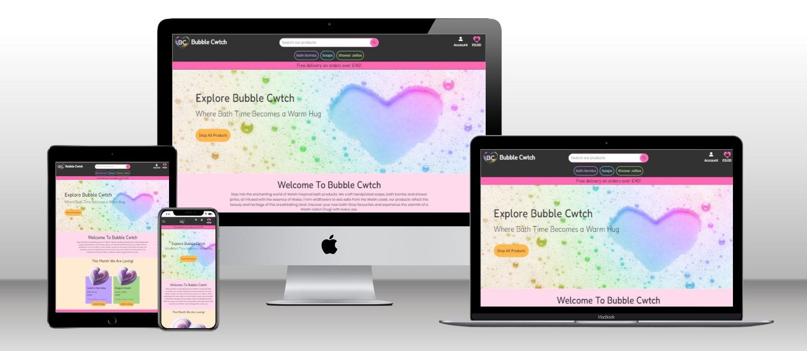

# Bubble Cwtch - E-Commerce Site - Using Django



#### **By Hannah Bowles**
[Click here to view the live web application](https://bubble-cwtch-7479c697eb91.herokuapp.com/)

The testing document for Bubble Cwtch

- - -
## Table of Contents

- [Introduction](#introduction)
- [Automated Testing](#automated-testing-using-test-driven-development)
- [Validation](#validation)
    - [HTML Validation](#html-validation)
    - [CSS Validation](#css-validation)
    - [JavaScript Linting](#javascript-linting)
    - [Python Linting](#python-linting)
    - [Accessibility Testing](#accessibility)
    - [Performance Testing](#performance)
- [Manual Testing](#manual-testing)
    - [Responsiveness/Device Testing](#responsiveness--devices)
    - [Browser Compatibility](#browser-compatibility)
    - [Feature Testing Results](#feature-testing-results)
- [User Stories Testing](#user-stories-testing)
- [Bugs and Fixes](#bugs--fixes)


---

## Introduction

I wanted implemented a thorough testing strategy combining both automated and manual testing methods. Below are the key aspects of the testing plan and the results obtained from testing on the [deployed site](https://bubble-cwtch-7479c697eb91.herokuapp.com/).

---

## Automated Testing

During development, I aimed to maintain a test-driven approach, which was my first experience with automated testing. Despite facing time constraints, I found automated testing to be a valuable tool in identifying issues and ensuring my code behaved as expected.

While the project is submitted, I plan to revisit it and write additional tests. Although I achieved a test coverage of 68%, I would have preferred to reach 100%. However, due to time limitations, I prioritised achieving a minimum viable product (MVP).

I enjoyed writing tests and using the coverage report to identify any missed lines, allowing me to create targeted tests for those areas. This approach proved effective in detecting bugs earlier in the development process, and I look forward to utilising it more in the future.

## Coverage Report

After running the coverage report, I generated the HTML coverage report, which enabled me to thoroughly explore and identify areas of my codebase that lacked sufficient test coverage, allowing me to prioritise and address these gaps when making more tests.

These are the commands I used to create the reports.
```bash
coverage run manage.py test
```

```bash
coverage html
```

My coverage result can me found here [Coverage Report](coverage_report.txt)

I used the follwing command to create this:

```bash
coverage report > coverage_report.txt
```

## Running Tests

I run tests for my Django project in the terminal. You can do this by navigating to the root directory of the project and use the following command:

### All Tests

```bash
python3 manage.py test
```

### All Tests In An App

Replace app_name with the name of the Django app

```bash
python3 manage.py test app_name
```

### A Specfic Test File

Replace app_name with the name of the Django app containing the test file, test_module with the Python module you want to run

```bash
pythona manage.py test app_name.test_module
```

- - -

## Validation

### HTML Validation

I used [W3 HTML Validator](https://validator.w3.org/) using the textarea input by generating the source code from the deployed site (right click and select 'View Page Source' in Chrome) and pasting it in to allow me to check all pages whether requiring log in or not. All code passed the validation tests.


### CSS Validation

I used [W3 CSS Validator](https://jigsaw.w3.org/css-validator/) to validate the style.css file and received no errors.
The 21 warnings are for vendor extentions - no change is needed and one for using varibles - which due to their dynamic nature, CSS variables are currently not statically checked.

### JavaScript Linting

I used [JS Hint](https://jshint.com/) to validate my JavaScript code on all .js files within the project. I needed to add start my files with `/*jshint esversion: 6 */` to make sure jshint would treat the code by the standards of ES6. 


### Python Linting
I used the Code Institute [Python Linter](https://pep8ci.herokuapp.com/) to validate my python code in all files. A few warnings were noted with lines being too long or blank line issues, so these were amended. All files passed with no warnings after this.


### Accessibility

I used the [Wave Web Accessibility Evaluation Tool](https://wave.webaim.org/) to test the accessibility of the site. All pages passed with no errors, A few have warnings which I would look at improving in the future.


### Performance

I used the Lighthouse feature of Google Dev Tools to assess the scores of the site pages.

- **Mobile Performance**: All pages exhibited suboptimal performance on mobile devices. However, when compared to other MS4 projects and the Boutique Ado, the performance was found to be comparable.

- **Desktop Performance**: Performance on desktop was noticeably better. An immediate improvement area identified is the utilisation of WebP image files instead of PNGs. This optimisation could significantly enhance page load times and overall performance.

- - -

## Manual Testing
I performed extensive manual testing for each component as it was integrated. Utilising Google Chrome DevTools, I examined the code directly from the browser while simultaneously observing the rendered site.

Upon achieving full functionality, I actively engaged friends, family, and members of my Code Institute cohort to interact with the site extensively. This approach aimed to identify any user experience gaps or components that deviated from user expectations during real-life usage scenarios. 

Their feedback played a crucial role in refining the project and ensuring its usability and effectiveness.

- - -

##

| User Story                                                                             | Site Path                                                                                            | Result |
|----------------------------------------------------------------------------------------|------------------------------------------------------------------------------------------------------|--------|
| **As a General User**                                                                  |                                                                                                      |        |
| Understand the purpose of Bubble Cwtch immediately upon entering the website         | Upon entering the home page, read the branding & explanatory text section                          | Passed |
| Easily find products with intuitive navigation                                       | Navigate through the site using the navigation menu                                                 | Passed |
| Bubble Cwtch to be fully responsive for seamless browsing                             | The website is accesable on various devices and screen sizes                                             | Passed |
| Find Bubble Cwtch on social media for brand insights                                   | Look for social media icons or links in the footer or header                                         | Passed |
| Effortless navigation back to the main site without relying on browser buttons         | Use the site's navigation menu                                          | Passed |
| Get feedback when interacting with Bubble Cwtch to confirm the success of my actions   | Toast messages displayed for site interations - add items / removing / sign up                                 | Passed |
| **As a Shopper**                                                                       |                                                                                                      |        |
| Browse Bubble Cwtch's products easily, with options to filter and search              | Use the product listing page to filter and search for specific items                                  | Passed |
| Access more information about each product                                            | Click on a product to view its details                                                              | Passed |
| Add a product to my bag quickly and with minimum clicks                               | Click the "Add to Bag" button on a product page                                                      | Passed |
| Shop for multiple items across Bubble Cwtch's product range                           | View all products on products page view                                                              | Passed |
| Add multiples of a single product to my shopping bag at once                          | Adjust the quantity of the product before adding it to the shopping bag from product details page                              | Passed |
| Edit my shopping bag contents easily, adding or removing items as needed              | Use the shopping bag page to edit the contents                                                        | Passed |
| Know the delivery charge for my order before proceeding to Checkout                    | Delivery chareg is displayed when add items to the bag and in the bag page                                            | Passed |
| Ensure my payment and order are fully secure and trustworthy                          | Use of stripe to handle payments                             | Passed |
| Have the option to create an account on Bubble Cwtch to save my order history         | Access the sign up page from nav bar and complete the registration process                                | Passed |
| **As a User with an Account**                                                          |                                                                                                      |        |
| Ensure my account on Bubble Cwtch is secure and straightforward to set up            | Complete the account setup process with ease and without security concerns                             | Passed |
| See my order history easily, reviewing past purchases and tracking current orders     | Access the order history section in the user profile settings                                             | Passed |
| Update and save my personal information within my account settings                    | Edit personal information fields in the user profile settings                                              | Passed |
| View the status of my order, allowing me to track its progress                        | Check the order status when going into order history                                               | Passed |
| **As an Admin of the Site**                                                            |                                                                                                      |        |
| Add and edit products easily                                                           | Access the product management section from product pages or nav link dashboard                                          | Passed |
| Remove products from sale, managing product availability                               | Utilise the product management buttons on theproduct pages                                           | Passed |
| Edit featured products                                                                 | Access the featured product management section in the admin dashboard                                  | Passed |
| View all orders and filter by status                                                   | Navigate to the order management section in the admin dashboard or profile and apply filters as needed                     | Passed |
| Update the status of a customer's order easily                                         | Access the order details and status update section in the admin dashboard or profile page                             | Passed |
| Easily navigate to the Django admin                                                    | Access the Django admin panel via the provided link                                                    | Passed |
| Ensure the admin controls blend with the site design but stand out                     | Review the admin controls' design and appearance for consistency and visibility  - used a pink backgroun for these sections                       | Passed |


## Bugs and Fixes

I encountered an issue with email delivery in our live environment while it worked flawlessly in development raised concerns about system reliability and user experience. Despite attempts to fix it by updating Gmail app passwords and resetting configuration variables in Heroku, the problem persisted, leading me to explore other diagnostic options.

To find the issue, I turned to Mailbox, a test SMTP tool, to replicate email sending in a controlled environment. The tests confirmed that my Django application's email-sending feature was functional, suggesting that the problem stemmed from the live environment's SMTP configuration.

Despite trying various suggestions from Slack, like creating a runtime.txt file, none seemed to resolve the issue. Eventually, I manually set the variables in my code (removed the commit to protect my password, and created a new one) Testing Gmail SMTP functionality showed it was working correctly. However, resetting the variables in Heroku led to another failure.

In the end, I opted to set the variables directly in the terminal, which finally resolved the issue. It appears that while copying and pasting the variables into Heroku's desktop interface, there might have been some unexpected characters causing discrepancies. Setting them via the terminal ensured accuracy and resolved the problem conclusively.


[Return to README](README.md)